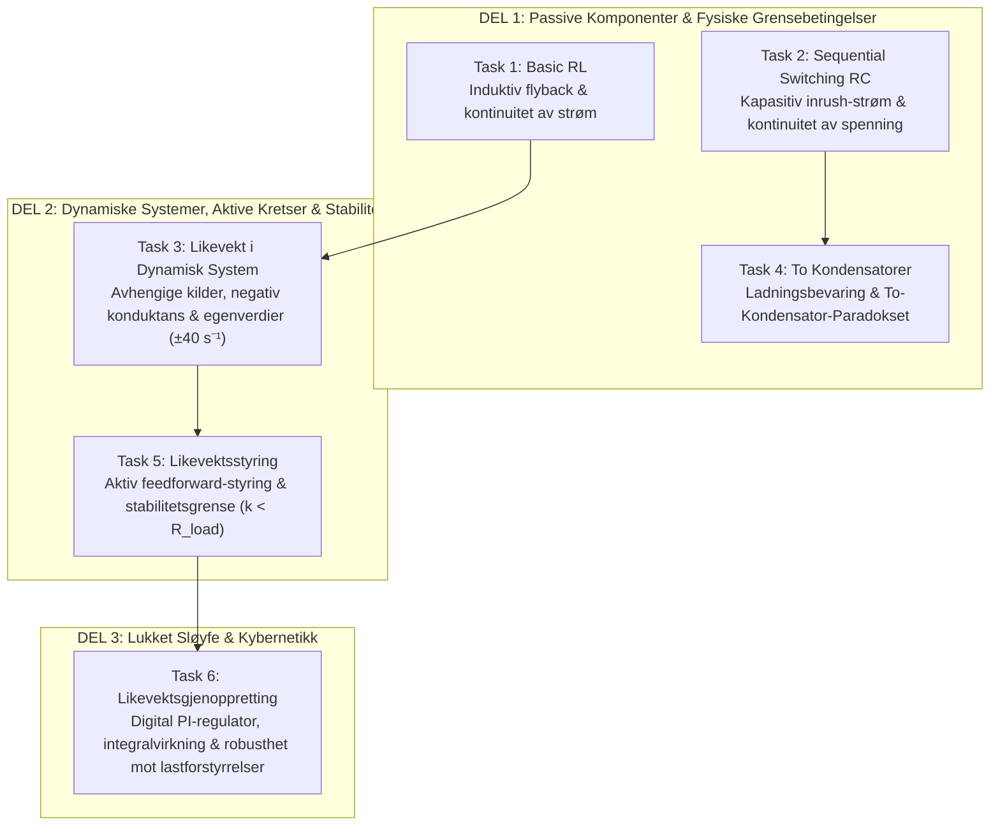
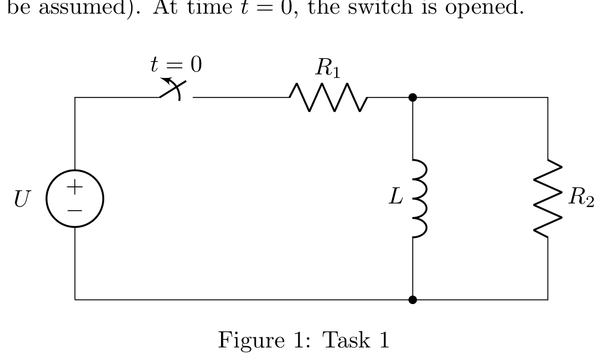
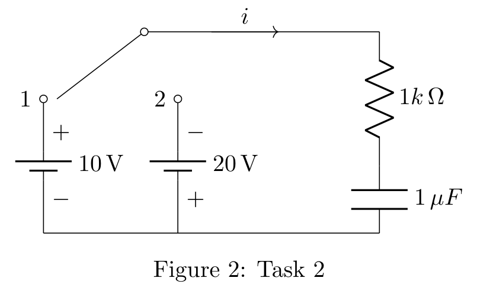
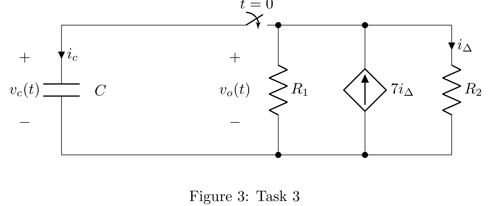
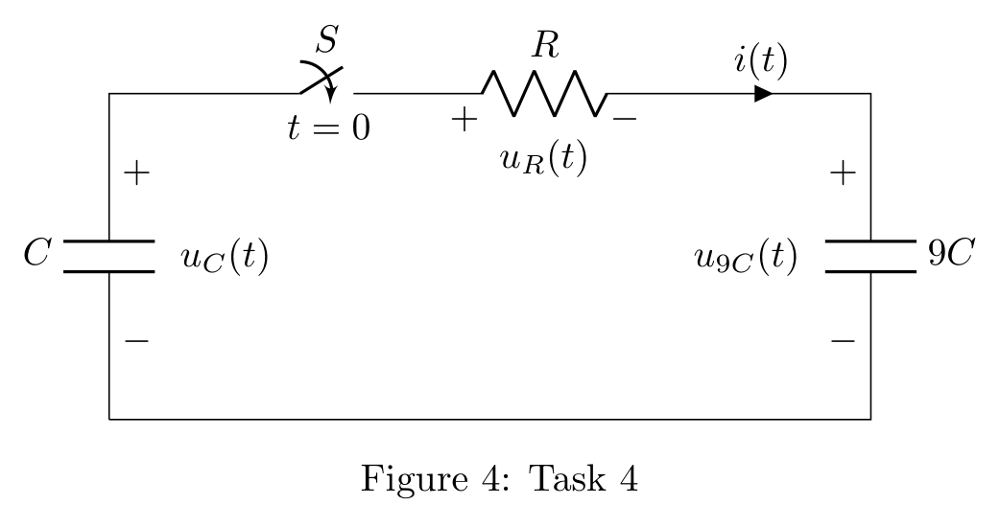
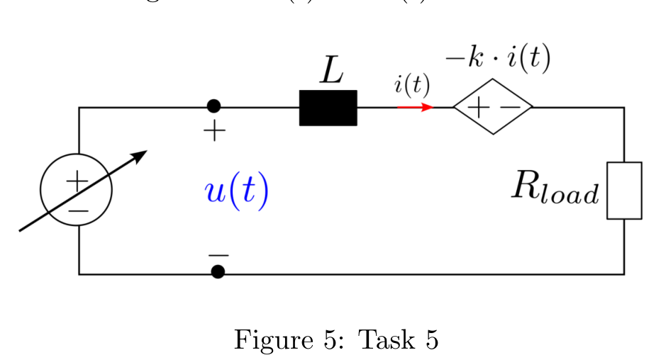
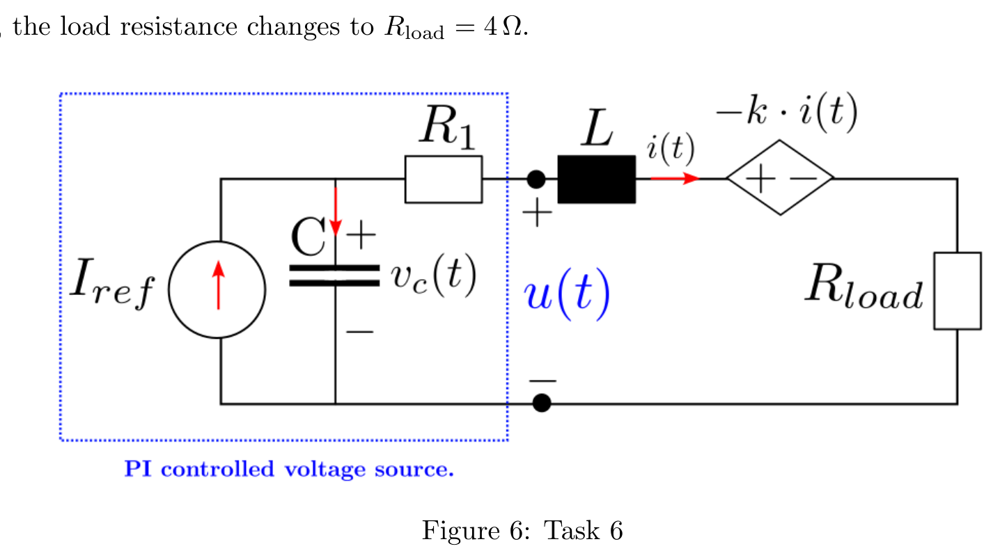

# TET4100 Elektriske Kretser: SLT-1 – Komplett Faglig Kompendium & Løsningsguide
**Institutt for elektrisk energi, NTNU**  
*Forfattere av oppgavesettet: Daniel Baltensperger, Gilbert Bergna-Diaz, Erlend Redi Haga*  
*Faglig veileder og pedagogisk fremstilling: Antigravity AI*

---

## 1. Det Store Bildet (The Big Picture)

Hensikten med SLT-1 (Semester Learning Task 1) er ikke bare å regne på motstander, spoler og kondensatorer. Oppgavesettet er en **nøye komponert pedagogisk reise** som tar deg fra de mest grunnleggende fysiske bevaringslovene i elektriske kretser, videre til dynamiske systemer og stabilitetsteori, og kulminerer i moderne **digital reguleringsteknikk (PI-regulering)** som brukes i kraftelektronikk, elbiler og fornybar energi.



### Hovedprinsippene du lærer gjennom oppgavene:
1. **Tilstandskontinuitet og ekstreme transienter (Oppgave 1 & 2):**
   - En spole motsetter seg brå endringer i **strøm** ($v_L = L \frac{di}{dt}$). Bryter du strømmen brått, svarer kretsen med en voldsom spenningsspiss (**inductive kick / flyback**).
   - En kondensator motsetter seg brå endringer i **spenning** ($i_C = C \frac{dv_C}{dt}$). Endrer du spenningen over kretsen brått, svarer kretsen med et enormt strømsjokk (**inrush current**).
2. **Dynamisk stabilitet og negativ resistans (Oppgave 3 & 5):**
   - Når kretser inneholder aktive elementer (f.eks. transistorer, op-amper, avhengige kilder), kan de levere energi i stedet for å forbruke den. Dette tilsvarer en *negativ resistans*.
   - Dersom den negative resistansen overvinner den positive dempningen i kretsen, flytter systemets pol (egenverdi) seg til høyre halvplan ($\text{Re}\{s\} > 0$), og likevekten blir **ustabil** (signalet eksploderer).
3. **Bevaringslover og systemorden (Oppgave 4):**
   - Antall energilagrende elementer er *ikke alltid* lik systemets orden. Hvis to kondensatorer deler samme strøm i en lukket krets, bevares den totale ladningen. Kretsen mister en frihetsgrad og reduseres til et **førsteordens system**.
   - Uansett hvor liten motstanden $R$ er mellom to kondensatorer, vil nøyaktig $90\ \%$ av energien tapes som varme eller stråling under ladningsutligningen. Dette er det berømte *To-kondensator-paradokset*.
4. **Hvorfor åpen sløyfe svikter, og hvorfor vi trenger PI-regulering (Oppgave 5 & 6):**
   - I Oppgave 5 prøver vi å styre strømmen med en forhåndsberegnet konstant spenning $\bar{u}$ (**feedforward / åpen sløyfe**). Dette fungerer *kun* så lenge lasten $R_{\text{load}}$ er nøyaktig kjent.
   - I Oppgave 6 endrer lasten seg uventet, og den åpne sløyfen feiler katastrofalt (strømmen tredobles fra $4\text{ A}$ til $12\text{ A}$!).
   - Løsningen er å innføre en **tilbakekobling med integralvirkning (PI-regulator)**. Kondensatoren integrerer avviket over tid og tvinger feilen til **nøyaktig null**, fullstendig uavhengig av parametere i lasten!

---

## 2. Detaljert Gjennomgang og Utregning av Alle Oppgaver

---

### Oppgave 1: Basic RL (Transient respons og induktiv kickback)

> **Oppgavetekst (Oppgave 1 &ndash; Norsk oversettelse):**
> *Kretsen vist i figur 1 inneholder en spole med induktans  = 120\text{ mH}$ samt motstandene  = 24\,\Omega$ og  = 48\,\Omega$. Forsyningsspenningen er  = 36\text{ V}$, og bryteren har vært lukket i lang tid (stasjonærtilstand kan antas). Ved tidspunktet  = 0$ åpnes bryteren.*



#### Kretsoppbygning og parametere:
- Spole: $L = 120\text{ mH} = 0.12\text{ H}$
- Motstander: $R_1 = 24\,\Omega$, $R_2 = 48\,\Omega$
- Kilde: DC spenningskilde $U = 36\text{ V}$
- Tilstand for $t < 0$: Bryteren har vært lukket i lang tid (stasjonærtilstand / DC steady-state).
- Ved $t = 0$: Bryteren åpnes.

#### (a) Bestem spenningen over spolen like før bryteren åpnes, $v_L(0^-)$
I stasjonærtilstand under likespenning (DC) oppfører en ideell spole seg som en **kortslutning** ($\frac{di}{dt} = 0$):
$$v_L(t) = L \frac{di_L}{dt} = L \cdot 0 = 0\text{ V}$$
$$\mathbf{v_L(0^-) = 0\text{ V}}$$

#### (b) Bestem spolestrømmen like før bryteren åpnes, $i_L(0^-)$
Siden spolen er i parallell med motstand $R_2$, og spenningen over spolen er $v_L(0^-) = 0\text{ V}$, er også spenningen over $R_2$ lik $0\text{ V}$.
Dermed flyter det ingen strøm gjennom $R_2$:
$$i_{R2}(0^-) = \frac{v_L(0^-)}{R_2} = \frac{0}{48} = 0\text{ A}$$
All strøm fra spenningskilden $U$ og motstand $R_1$ må derfor gå gjennom spolen $L$:
$$i_L(0^-) = \frac{U}{R_1} = \frac{36\text{ V}}{24\,\Omega} = 1.5\text{ A}$$
$$\mathbf{i_L(0^-) = 1.5\text{ A}}$$ (rettet nedover gjennom spolen).

#### (c) Bestem spenningen over spolen like etter bryteren åpnes, $v_L(0^+)$
Strømmen gjennom en induktans kan ikke endre seg sprangvis (fordi det ville krevd uendelig spenning og uendelig effekt):
$$i_L(0^+) = i_L(0^-) = 1.5\text{ A}$$
Når bryteren åpnes ved $t = 0$, blir kilden $U$ og motstanden $R_1$ fullstendig frakoblet.
Den gjenværende kretsen består utelukkende av en lukket sløyfe mellom spolen $L$ og motstanden $R_2$.
Strømmen på $1.5\text{ A}$ som flyter nedover gjennom spolen, må fortsette langs bunnlederen og gå **oppover** gjennom motstanden $R_2$.
Med passiv fortegnskonvensjon (hvor $v_L$ er definert med $+$ på toppen og $-$ på bunnen):
$$v_{R2}(0^+) = - i_L(0^+) \cdot R_2 = -(1.5\text{ A}) \cdot (48\,\Omega) = -72\text{ V}$$
Siden toppen av $L$ er koblet direkte til toppen av $R_2$:
$$\mathbf{v_L(0^+) = -72\text{ V}}$$

> [!WARNING]
> **Fysisk fenomen – Induktiv spenningsspiss (Flyback):**
> Spenningen hopper momentant fra $0\text{ V}$ til **$-72\text{ V}$**! Dette er dobbelt så høyt som kildespenningen ($36\text{ V}$), og har motsatt polaritet. I reelle kretser uten beskyttelse kan dette ødelegge brytere eller transistorer.

#### (d) Finn uttrykket for spolestrømmen $i_L(t)$ for $t \ge 0^+$
For $t > 0$ gir Kirchhoffs spenningslov (KVL) i sløyfen:
$$v_L(t) + R_2 i_L(t) = 0 \implies L \frac{di_L}{dt} + R_2 i_L(t) = 0$$
$$\frac{di_L}{dt} + \frac{R_2}{L} i_L(t) = 0$$
Tidskonstanten for kretsen er:
$$\tau = \frac{L}{R_2} = \frac{120\text{ mH}}{48\,\Omega} = \frac{0.12}{48} = 0.0025\text{ s} = 2.5\text{ ms}$$
Den inverse tidskonstanten er $\frac{1}{\tau} = \frac{48}{0.12} = 400\text{ s}^{-1}$.
Løsningen med initialbetingelse $i_L(0^+) = 1.5\text{ A}$ er:
$$\mathbf{i_L(t) = 1.5 e^{-400 t}\text{ A} = 1.5 e^{-t / 2.5\,\text{ms}}\text{ A}} \quad (t \ge 0)$$
Spenningen over spolen blir tilsvarende:
$$v_L(t) = L \frac{di_L}{dt} = 0.12 \cdot (-400) \cdot 1.5 e^{-400t} = \mathbf{-72 e^{-400 t}\text{ V}}$$

#### (e) Ved hvilket tidspunkt når $i_L(t)$ verdien $1\text{ A}$?
Vi setter $i_L(t) = 1\text{ A}$:
$$1.5 e^{-400 t} = 1 \implies e^{-400 t} = \frac{1}{1.5} = \frac{2}{3}$$
$$e^{400 t} = \frac{3}{2} = 1.5 \implies 400 t = \ln(1.5)$$
$$t = \frac{\ln(1.5)}{400} = \frac{0.405465}{400} \approx 0.0010137\text{ s} = \mathbf{1.014\text{ ms}}$$

---

### Oppgave 2: Sequential Switching RC (Sekvensiell Svitsjing)

> **Oppgavetekst (Oppgave 2 &ndash; Norsk oversettelse):**
> *Betrakt RC-kretsen vist i Figur 2. Bryteren flyttes til posisjon 1 ved  = 0$, og etter én tidskonstant (\tau) flyttes den til posisjon 2 for en ytterligere varighet på \tau$. Anta at kondensatoren i utgangspunktet er uladet ((0) = 0$). Merk: Tidskonstanten $\tau = -1/s$ der $ er roten til den karakteristiske ligningen.*



#### Kretsoppbygning og parametere:
- Motstand $R = 1\text{ k}\Omega = 1000\,\Omega$
- Kondensator $C = 1\,\mu\text{F} = 10^{-6}\text{ F}$
- Tidskonstant: $\tau = R C = 1000 \cdot 10^{-6} = 0.001\text{ s} = 1\text{ ms}$
- Posisjon 1: Tilkoblet kilde $+10\text{ V}$ ($+$ oppe, $-$ nede).
- Posisjon 2: Tilkoblet kilde $-20\text{ V}$ ($-$ oppe, $+$ nede).
- Initialtilstand: Kondensatoren er uladet, $v_C(0) = 0\text{ V}$.
- Forløp:
  - $0 \le t < \tau$: Bryteren er i posisjon 1.
  - Ved $t = \tau$: Bryteren flyttes momentant til posisjon 2 for en varighet på $5\tau$ (dvs. til $t = 6\tau$).

#### (a) Finn uttrykket for kondensatorspenningen $v_C(t)$ for $0 \le t < \tau$
Generell løsning for et 1. ordens RC-trinn:
$$v_C(t) = V_{\text{slutt}} + (V_{\text{start}} - V_{\text{slutt}}) e^{-t/\tau}$$
Her er $V_{\text{start}} = 0\text{ V}$, $V_{\text{slutt}} = +10\text{ V}$, og $\tau = 1\text{ ms}$:
$$\mathbf{v_C(t) = 10(1 - e^{-t/\tau})\text{ V} = 10(1 - e^{-1000 t})\text{ V}} \quad (0 \le t < \tau)$$

#### (b) Bestem verdien av $v_C(t)$ ved svitsjeøyeblikket $t = \tau^+$
Spenningen over en kondensator er en tilstandsvariabel og kan **ikke** endre seg sprangvis ved endelig strøm:
$$v_C(\tau^+) = v_C(\tau^-) = 10(1 - e^{-1})\text{ V}$$
Siden $e^{-1} \approx 0.367879$:
$$v_C(\tau^+) = 10(1 - 0.367879) \approx \mathbf{6.321\text{ V}}$$

#### (c) Finn uttrykket for $v_C(t)$ for $\tau^+ \le t \le 6\tau$
Ved $t = \tau$ kobles kretsen til kilde 2, som har potensial $-20\text{ V}$ på toppen.
Dermed er det nye stasjonære målet $V_{\text{slutt}} = -20\text{ V}$.
Startverdien for dette intervallet er $v_C(\tau) = 10(1 - e^{-1})\text{ V}$.
Vi definerer tiden etter omkobling som $(t - \tau)$:
$$v_C(t) = V_{\text{slutt}} + [v_C(\tau) - V_{\text{slutt}}] e^{-(t - \tau)/\tau}$$
$$v_C(t) = -20 + [10(1 - e^{-1}) - (-20)] e^{-(t - \tau)/\tau}$$
$$v_C(t) = -20 + [30 - 10e^{-1}] e^{-(t - \tau)/\tau} = \mathbf{-20 + 10(3 - e^{-1}) e^{-(t - \tau)/\tau}\text{ V}}$$
Numerisk: $30 - 10e^{-1} \approx 26.321\text{ V}$, så:
$$\mathbf{v_C(t) \approx -20 + 26.321\, e^{-(t - 0.001)/0.001}\text{ V}} \quad (\tau \le t \le 6\tau)$$

#### (d) Bestem og skisser strømmen $i(t)$ fra $0 \le t \le 6\tau$
Strømmen gjennom motstanden og kondensatoren er gitt ved Ohms lov og kondensatorligningen:
$$i(t) = \frac{v_{\text{kilde}} - v_C(t)}{R} = C \frac{dv_C}{dt}$$

- **Intervall 1 ($0 \le t < \tau$):**
  $$i(t) = \frac{10 - 10(1 - e^{-t/\tau})}{1000\,\Omega} = \frac{10 e^{-t/\tau}}{1000} = 10 e^{-1000 t}\text{ mA} = \mathbf{0.01 e^{-1000 t}\text{ A}}$$
  Rett før omkobling ($t = \tau^-$):
  $$i(\tau^-) = 10 e^{-1} \approx \mathbf{+3.68\text{ mA}}$$

- **Spranget ved $t = \tau^+$:**
  Kildespenningen hopper momentant fra $+10\text{ V}$ til $-20\text{ V}$, mens $v_C(\tau^+) = 6.321\text{ V}$:
  $$i(\tau^+) = \frac{-20\text{ V} - 6.321\text{ V}}{1000\,\Omega} = \frac{-26.321\text{ V}}{1000\,\Omega} = \mathbf{-26.32\text{ mA}}$$

- **Intervall 2 ($\tau \le t \le 6\tau$):**
  $$i(t) = \mathbf{-26.32\, e^{-(t - \tau)/\tau}\text{ mA}}$$
  
> [!IMPORTANT]
> **Fysisk innsikt – Strømsjokk:** Mens spenningen $v_C(t)$ er kontinuerlig, hopper strømmen momentant fra $+3.68\text{ mA}$ til $-26.32\text{ mA}$. Dette viser at strømmen i en kondensatorkrets er diskontinuerlig ved svitsjing av kilder.

---

### Oppgave 3: Likevekt i et Dynamisk System (Aktiv krets & Stabilitet)

> **Oppgavetekst (Oppgave 3 &ndash; Norsk oversettelse):**
> *La oss betrakte kretsen i Figur 3 med følgende parametere:  = 10\text{ k}\Omega$,  = 20\text{ k}\Omega$ og  = 5\,\mu\text{F}$.
> 1. Utled differensialligningen som beskriver (t)$ for  > 0$.
> 2. Er differensialligningen homogen eller inhomogen? Begrunn kort svaret ditt.
> 3. Løs differensialligningen ved å bruke en eksponentiell prøveløsning for tre ulike initialbetingelser: (0^+) = 10\text{ V}, 0\text{ V}, -2\text{ V}$.
> 4. Gjenta deloppgave 3 med  = 2\text{ k}\Omega$.
> 5. Bestem likevektspunktet og klassifiser likevektene som stabile eller ustabile.*



#### Kretsoppbygning og parametere:
- Kondensator: $C = 5\,\mu\text{F} = 5 \times 10^{-6}\text{ F}$ med spenning $v_c(t)$ og strøm $i_c$ nedover.
- Bryter lukkes ved $t = 0$.
- Parallellgren med motstand $R_1$ (spenning $v_0(t)$ over seg).
- Avhengig strømkilde: $7 i_\Delta$ rettet **oppover**.
- Parallellgren med motstand $R_2 = 20\text{ k}\Omega = 20000\,\Omega$, strøm $i_\Delta$ rettet **nedover**.
- To tilfeller for $R_1$: Deloppgave 3 har $R_1 = 10\text{ k}\Omega$; Deloppgave 4 har $R_1 = 2\text{ k}\Omega$.

#### 1. Utled differensialligningen som beskriver $v_0(t)$ for $t > 0$
Når bryteren lukkes ved $t = 0$, kobles kondensatoren i direkte parallell med resten av nettverket:
$$v_0(t) = v_c(t)$$
Vi setter opp Kirchhoffs strømlov (KCL) i toppnoden (strømmer som forlater noden nedover):
- Strøm gjennom kondensator: $i_c = C \frac{dv_0}{dt}$
- Strøm gjennom $R_1$: $i_{R1} = \frac{v_0}{R_1}$
- Strøm gjennom avhengig strømkilde: Den er rettet oppover, så strøm ut av noden nedover er $-7 i_\Delta$.
- Strøm gjennom $R_2$: $i_\Delta = \frac{v_0}{R_2}$

Summen av strømmer ut av toppnoden er null:
$$C \frac{dv_0}{dt} + \frac{v_0}{R_1} - 7 i_\Delta + i_\Delta = 0$$
Sett inn $i_\Delta = \frac{v_0}{R_2}$:
$$C \frac{dv_0}{dt} + \frac{v_0}{R_1} - 6 \left(\frac{v_0}{R_2}\right) = 0$$
$$C \frac{dv_0}{dt} + \left( \frac{1}{R_1} - \frac{6}{R_2} \right) v_0(t) = 0$$
Divider med $C$:
$$\mathbf{\frac{dv_0(t)}{dt} + \frac{1}{C}\left( \frac{1}{R_1} - \frac{6}{R_2} \right) v_0(t) = 0}$$

#### 2. Er differensialligningen homogen eller inhomogen? Begrunn kort.
Differensialligningen er **HOMOGEN**.  
**Begrunnelse:** Det finnes ingen uavhengige kilder (høyresiden er 0, dvs. $f(t) = 0$). Alle ledd i ligningen avhenger direkte av tilstandsvariabelen $v_0(t)$ eller dens deriverte. Kretsen drives utelukkende av sin egen initialenergi lagret i kondensatoren.

#### 3. Løs ligningen med eksponentiell prøveløsning for $R_1 = 10\text{ k}\Omega$
Vi beregner konduktansen til kretsen for $R_1 = 10\text{ k}\Omega$ og $R_2 = 20\text{ k}\Omega$:
$$G_{\text{eq}} = \frac{1}{R_1} - \frac{6}{R_2} = \frac{1}{10000} - \frac{6}{20000} = 0.0001 - 0.0003 = -0.0002\text{ S} = -0.2\text{ mS}$$
Koeffisienten foran $v_0$ i differensialligningen blir:
$$\frac{G_{\text{eq}}}{C} = \frac{-0.0002\text{ S}}{5 \times 10^{-6}\text{ F}} = -40\text{ s}^{-1}$$
Dermed blir differensialligningen:
$$\frac{dv_0}{dt} - 40 v_0 = 0 \implies \frac{dv_0}{dt} = 40 v_0$$
Karakteristisk ligning med $v_0(t) = A e^{st}$:
$$s - 40 = 0 \implies s = +40\text{ s}^{-1}$$
Den generelle løsningen er:
$$v_0(t) = v_0(0^+) e^{40 t}$$

For de tre gitte initialbetingelsene:
1. $v_0(0^+) = +10\text{ V} \implies \mathbf{v_0(t) = 10 e^{40 t}\text{ V}}$ (Eksploderer mot $+\infty$)
2. $v_0(0^+) = 0\text{ V} \implies \mathbf{v_0(t) = 0\text{ V}}$ (Forblir i origo)
3. $v_0(0^+) = -2\text{ V} \implies \mathbf{v_0(t) = -2 e^{40 t}\text{ V}}$ (Eksploderer mot $-\infty$)

Ved slutten av tidsvektoren $t = 67\text{ ms} = 0.067\text{ s}$:
$$e^{40 \cdot 0.067} = e^{2.68} \approx 14.585$$
- For $10\text{ V}$: $v_0(0.067) = 10 \cdot 14.585 = \mathbf{145.85\text{ V}}$!
- For $-2\text{ V}$: $v_0(0.067) = -2 \cdot 14.585 = \mathbf{-29.17\text{ V}}$!

#### 4. Gjenta for $R_1 = 2\text{ k}\Omega$
Nå setter vi $R_1 = 2\text{ k}\Omega = 2000\,\Omega$:
$$G_{\text{eq}} = \frac{1}{R_1} - \frac{6}{R_2} = \frac{1}{2000} - \frac{6}{20000} = 0.0005 - 0.0003 = +0.0002\text{ S} = +0.2\text{ mS}$$
Koeffisienten foran $v_0$:
$$\frac{G_{\text{eq}}}{C} = \frac{+0.0002}{5 \times 10^{-6}} = +40\text{ s}^{-1}$$
Differensialligningen blir:
$$\frac{dv_0}{dt} + 40 v_0 = 0 \implies s = -40\text{ s}^{-1}$$
Løsningen er:
$$v_0(t) = v_0(0^+) e^{-40 t}$$

For de tre initialbetingelsene:
1. $v_0(0^+) = +10\text{ V} \implies \mathbf{v_0(t) = 10 e^{-40 t}\text{ V}}$ (Dør ut mot $0$)
2. $v_0(0^+) = 0\text{ V} \implies \mathbf{v_0(t) = 0\text{ V}}$
3. $v_0(0^+) = -2\text{ V} \implies \mathbf{v_0(t) = -2 e^{-40 t}\text{ V}}$ (Dør ut mot $0$)

Ved $t = 67\text{ ms}$: $e^{-2.68} \approx 0.0685$, så $v_0(0.067) = 10 \cdot 0.0685 = \mathbf{0.685\text{ V}}$.

#### 5. Likevektspunkter, stabilitet og fortegn til eksponentkoeffisienten
- **Likevektspunkt:** Et likevektspunkt oppstår der $\frac{dv_0}{dt} = 0$. For begge tilfeller krever dette:
  $$G_{\text{eq}} v_0^* = 0 \implies \mathbf{v_0^* = 0\text{ V}}$$
- **Klassifisering:**
  - For $R_1 = 10\text{ k}\Omega$: Egenverdien (polen) er $\lambda = s = \mathbf{+40 > 0}$. Likevekten er et **USTABILT likevektspunkt** (repeller). Det minste lille avvik fra 0 vil vokse eksponentielt uten grenser.
  - For $R_1 = 2\text{ k}\Omega$: Egenverdien er $\lambda = s = \mathbf{-40 < 0}$. Likevekten er et **STABILT (asymptotisk stabilt) likevektspunkt** (attraktor). Uansett hvor systemet starter, vender det tilbake til $0\text{ V}$.
- **Fysisk sammenheng:** Den avhengige kilden pumper energi inn i kretsen tilsvarende en negativ konduktans på $-0.3\text{ mS}$. Når $R_1 = 10\text{ k}\Omega$ ($G_1 = 0.1\text{ mS}$), klarer ikke kretsen å dissipe energien, og netto konduktans blir negativ (energitilførsel $\implies$ ustabilitet). Når $R_1$ reduseres til $2\text{ k}\Omega$ ($G_1 = 0.5\text{ mS}$), dominerer dissipasjonen, netto konduktans blir positiv, og systemet blir stabilt!

---

### Oppgave 4: Strøm mellom To Kondensatorer (Ladningsutveksling & Paradoks)

> **Oppgavetekst (Oppgave 4 &ndash; Norsk oversettelse):**
> *En inngangskondensator $ med initialspenning (0^+) = U$ kobles ved  = 0$ via en motstand $ til en initialt uladet utgangskondensator som har ni ganger større kapasitans ($) enn inngangskondensatoren (symbolsk beregning).
> 1. Vis at selv om kretsen inneholder to energilagre, er den bare et førsteordens system. (Hint: (t) = -i_{9c}(t) = i(t)$).
> 2. Beregn den tidsavhengige strømmen ( \ge 0^+$).*



#### Kretsoppbygning og parametere:
- Inngangskondensator $C_1 = C$ med initialspenning $u_C(0^+) = U$.
- Utgangskondensator $C_2 = 9C$ med initialspenning $u_{9C}(0^+) = 0\text{ V}$.
- Kobles sammen ved $t = 0$ via en motstand $R$.
- KCL-hint: $i_C(t) = -i_{9C}(t) = i(t)$.

#### 1. Vis at kretsen er et 1. ordens system selv om den inneholder to energilagre
Vanligvis vil en krets med to reaktive elementer være av 2. orden. Hvorfor er denne kun av 1. orden?

**Bevis via ladningsbevaring:**
Kretsen danner en enkelt, isolert lukket sløyfe. Strømmen som forlater kondensator $C$ er nøyaktig den samme som går inn i kondensator $9C$:
$$i(t) = -\frac{dq_C}{dt} = +\frac{dq_{9C}}{dt}$$
Integrerer vi over tid, ser vi at total ladning i kretsen er strengt bevart for alle $t$:
$$q_C(t) + q_{9C}(t) = Q_{\text{tot}} = C \cdot U$$
Uttrykt med spenningene:
$$C u_C(t) + 9C u_{9C}(t) = C U \implies u_C(t) + 9 u_{9C}(t) = U$$
Dette er en **algebraisk bindingsligning** mellom de to spenningene. De to tilstandene er derfor *ikke uavhengige*. Kjenner vi den ene spenningen, er den andre deterministisk bestemt:
$$u_{9C}(t) = \frac{U - u_C(t)}{9}$$

**Bevis via differensialligningen for strømmen:**
Kirchhoffs spenningslov (KVL) rundt sløyfen gir:
$$u_C(t) - u_R(t) - u_{9C}(t) = 0 \implies R i(t) = u_C(t) - u_{9C}(t)$$
Deriver med hensyn på tid $t$:
$$R \frac{di}{dt} = \frac{du_C}{dt} - \frac{du_{9C}}{dt} = \left(-\frac{i(t)}{C}\right) - \left(+\frac{i(t)}{9C}\right) = -i(t)\left(\frac{1}{C} + \frac{1}{9C}\right)$$
Kondensatorene står i serie med hensyn på sløyfestrømmen. Ekvivalent kapasitans er:
$$\frac{1}{C_{\text{eq}}} = \frac{1}{C} + \frac{1}{9C} = \frac{10}{9C} \implies C_{\text{eq}} = \frac{9}{10} C = 0.9 C$$
Ligningen blir:
$$\mathbf{\frac{di(t)}{dt} + \frac{1}{R C_{\text{eq}}} i(t) = 0 \iff \frac{di(t)}{dt} + \frac{10}{9 R C} i(t) = 0}$$
Dette er en **førsteordens lineær differensialligning** med én enkelt tidskonstant $\tau = R C_{\text{eq}} = 0.9 R C$. Kretsen har kun én dynamisk frihetsgrad!

#### 2. Beregn den tidsavhengige strømmen $i(t)$ for $t \ge 0^+$
Ved $t = 0^+$ kan spenningene over kondensatorene ikke endre seg sprangvis:
$$u_C(0^+) = U, \quad u_{9C}(0^+) = 0\text{ V}$$
Spenningen over motstanden ved $t = 0^+$ er derfor:
$$u_R(0^+) = u_C(0^+) - u_{9C}(0^+) = U - 0 = U$$
Initialstrømmen er følgelig:
$$i(0^+) = \frac{u_R(0^+)}{R} = \frac{U}{R}$$
Med tidskonstanten $\tau = \frac{9}{10}RC$:
$$\mathbf{i(t) = \frac{U}{R} e^{-\frac{10 t}{9 R C}} = \frac{U}{R} e^{-t / (0.9 RC)}} \quad (t \ge 0^+)$$

> [!TIP]
> **Det Store Bildet – To-kondensator-paradokset og energitap:**
> - Initial energi i systemet: $E_i = \frac{1}{2} C U^2$.
> - Når strømmen dør ut ($t \to \infty$), oppnår begge kondensatorene samme sluttspenning $V_f$.  
>   Ved ladningsbevaring: $Q = (C + 9C) V_f = 10 C V_f = C U \implies V_f = 0.1 U$.
> - Sluttenergi i begge kondensatorer til sammen:
>   $$E_f = \frac{1}{2}(C + 9C) V_f^2 = \frac{1}{2}(10 C)(0.1 U)^2 = 0.1 \left( \frac{1}{2} C U^2 \right) = \mathbf{0.1 E_i}$$
> - **Nøyaktig 90 % av energien er tapt i motstanden som varme, uansett motstandsverdi $R$!**  
>   Hvis $R \to 0$, blir strømmen en uendelig høy Dirac-impuls, og energien tapes enten som en lysbue, termisk sjokk eller elektromagnetisk stråling. Dette er direkte årsaken til at elbiler og industrielle omformere krever egne *forladingskretser (pre-charge)*!

---

### Oppgave 5: Likevektsstyring (Equilibrium Control)

> **Oppgavetekst (Oppgave 5 &ndash; Norsk oversettelse):**
> *Kretsen vist i Figur 5 inneholder en initialt avmagnetisert spole  = 3\text{ H}$, lastmotstanden {\text{load}} = 6\,\Omega$ og en regulerbar spenningskilde (t)$. La (t)$ betegne strømmen gjennom spolen.
> (a) Utled differensialligningen som beskriver (t)$ samt den karakteristiske ligningen.
> (b) For hvilket verdiområde av $ er kretsen stabil? Begrunn svaret.
> (c) Finn uttrykket for en konstant verdi for kilden som funksjon av referansen: $\bar{u} = f(i^{\text{ref}})$.
> (d) Sørg for at $\lim_{t\to\infty} i(t) = 4\text{ A}$ når  = 3$.*



#### Kretsoppbygning og parametere:
- Induktans: $L = 3\text{ H}$ (initialt spenningsløs / avmagnetisert, $i(0) = 0$).
- Lastmotstand: $R_{\text{load}} = 6\,\Omega$.
- Avhengig spenningskilde i serie: spenningsfall definert som $-k \cdot i(t)$ ($+$ til venstre, $-$ til høyre).
- Regulerbar spenningskilde: $u(t)$.

#### (a) Utled differensialligningen for strømmen $i(t)$ og den karakteristiske ligningen
Vi bruker Kirchhoffs spenningslov (KVL) i sløyfen med klokken:
$$u(t) - v_L(t) - v_{\text{dep}}(t) - v_{\text{load}}(t) = 0$$
Hvor:
- $v_L(t) = L \frac{di}{dt}$
- $v_{\text{dep}}(t) = -k \cdot i(t)$
- $v_{\text{load}}(t) = R_{\text{load}} i(t)$

Setter vi dette inn:
$$u(t) - L \frac{di}{dt} - (-k \cdot i(t)) - R_{\text{load}} i(t) = 0$$
$$u(t) - L \frac{di}{dt} + k \cdot i(t) - R_{\text{load}} i(t) = 0$$
Flytter strømleddene over:
$$\mathbf{L \frac{di(t)}{dt} + (R_{\text{load}} - k) i(t) = u(t)}$$
For de gitte tallverdiene ($L = 3\text{ H}$, $R_{\text{load}} = 6\,\Omega$):
$$3 \frac{di}{dt} + (6 - k) i(t) = u(t)$$

Karakteristisk ligning (homogen del, $u(t) = 0$):
$$\mathbf{L s + (R_{\text{load}} - k) = 0 \implies 3s + (6 - k) = 0}$$
Roten (polen) til systemet er:
$$s = -\frac{R_{\text{load}} - k}{L} = \frac{k - 6}{3}$$

#### (b) For hvilket område av verdier for $k$ er kretsen stabil? Begrunn svaret.
For at et lineært tidsinvariant system skal være asymptotisk stabilt, må den karakteristiske roten ha en **strengt negativ reell del** ($\text{Re}\{s\} < 0$):
$$s = \frac{k - R_{\text{load}}}{L} < 0 \implies k < R_{\text{load}}$$
Med $R_{\text{load}} = 6\,\Omega$:
$$\mathbf{k < 6\,\Omega}$$
**Begrunnelse:** Leddet $(R_{\text{load}} - k)$ representerer den effektive serieresistansen i kretsen. Dersom $k > 6\,\Omega$, overstiger den aktive kildens forsterkning kretsens ohmske dempning. Kretsen får en negativ nettorestriktans, polen havner i høyre halvplan ($s > 0$), og strømmen vil vokse ukontrollert mot uendelig.

#### (c) Finn uttrykket for konstant kildespenning $\bar{u} = f(i^{\text{ref}})$ for å oppnå stasjonær strøm $i^{\text{ref}}$
I stasjonærtilstand ($t \to \infty$) slutter strømmen å endre seg, slik at $\frac{di}{dt} = 0$ og $i(t) \to \bar{i} = i^{\text{ref}}$.
Innsatt i differensialligningen:
$$L \cdot 0 + (R_{\text{load}} - k) i^{\text{ref}} = \bar{u}$$
$$\mathbf{\bar{u} = (R_{\text{load}} - k) i^{\text{ref}}}$$
Dette er et klassisk **feedforward-uttrykk** (åpen sløyfe).

#### (d) Dimensjoner og verifiser for $i^{\text{ref}} = 4\text{ A}$ og $k = 3\,\Omega$
- **Beregning av styrespenningen $\bar{u}$:**
  $$\bar{u} = (6\,\Omega - 3\,\Omega) \cdot 4\text{ A} = 3 \cdot 4 = \mathbf{12\text{ V}}$$
- **Løsning av differensialligningen og test av designet:**
  Med $u(t) = 12\text{ V}$ og $k = 3\,\Omega$:
  $$3 \frac{di}{dt} + (6 - 3) i(t) = 12 \implies 3 \frac{di}{dt} + 3 i(t) = 12 \implies \frac{di}{dt} + i(t) = 4$$
  Generell løsning: $i(t) = 4 + A e^{-t}$.
  Siden spolen var initialt avmagnetisert, er $i(0) = 0$:
  $$0 = 4 + A \implies A = -4$$
  $$\mathbf{i(t) = 4(1 - e^{-t})\text{ A}} \quad (t \ge 0)$$
  Når $t \to \infty$:
  $$\lim_{t \to \infty} i(t) = 4(1 - 0) = \mathbf{4\text{ A} = i^{\text{ref}}}$$
  Designet er verifisert: strømmen konvergerer stabilt og eksakt til ønsket verdi på $4\text{ A}$.

---

### Oppgave 6: Likevektsgjenoppretting (Equilibrium Restoration / PI-kontroll)

> **Oppgavetekst (Oppgave 6 &ndash; Norsk oversettelse):**
> *Denne oppgaven utvider Oppgave 5. Kilden (t)$ ble satt til en konstant $\bar{u} = 12\text{ V}$ slik at $\bar{i} = 4\text{ A}$ når {\text{load}} = 6\,\Omega$ og  = 3\,\Omega$.
> [Kontekst:] Lastmotstanden kan endre seg uforutsett uten at vi har mulighet til å oppdatere $\bar{u}$.
> (a) Ved  = 0$ endrer lastmotstanden seg brått til \,\Omega$. Bestem den nye likevektsstrømmen. Opererer systemet fortsatt ved \text{ A}True
> (b) Forklar hvorfor en ideell strømkilde i direkte serie ikke er egnet.
> (c) Utled en andreordens differensialligning for (t)$.
> (d) Bestem likevektsstrømmen $\bar{i} = \lim_{t\to\infty} i(t)$ og vis at $\bar{i} = 4\text{ A}$ uavhengig av parametere.
> (e) Vis at uttrykket for (t)$ tilsvarer en klassisk PI-regulator.*



#### Kontekst:
I Oppgave 5 var styringen basert på eksakt forhåndskunnskap om lasten ($R_{\text{load}} = 6\,\Omega$). I virkelige applikasjoner varierer imidlertid laster kontinuerlig (f.eks. en motor som belastes, eller et kraftnett med varierende forbruk).

#### (a) Hva skjer dersom lasten endres til $R_{\text{load}} = 4\,\Omega$ uten at $\bar{u} = 12\text{ V}$ oppdateres?
Med fast kildespenning $\bar{u} = 12\text{ V}$ og $k = 3\,\Omega$, men en ny lastverdi $R_{\text{load, ny}} = 4\,\Omega$:
I stasjonærtilstand for åpen sløyfe:
$$\bar{i}_{\text{ny}} = \frac{\bar{u}}{R_{\text{load, ny}} - k} = \frac{12\text{ V}}{4\,\Omega - 3\,\Omega} = \frac{12}{1} = \mathbf{12\text{ A}}$$
**Svar:** Systemet opererer **IKKE** lenger ved ønsket likevekt $i^* = 4\text{ A}$. Strømmen har skutt opp til **$12\text{ A}$** – et stasjonæravvik på hele $+8\text{ A}$ ($+200\ \%$ feil!). Dette beviser at ren foroverkobling (open-loop) er ekstremt sårbar for parametrisk usikkerhet.

---

#### Det digitale nettverket (blå stiplet boks i Fig. 6):
For å løse dette problemet erstattes den faste kilden med nettverket i Figur 6:
- Referansestrømkilde: $I_{\text{ref}} = 4\text{ A}$
- Parallellkondensator: $C = 0.15\text{ F}$, spenning $v_C(t)$
- Seriemotstand: $R_1 = 6\,\Omega$
- Initialtilstand (likevekt med $R_{\text{load}} = 6\,\Omega$): $i(0) = 4\text{ A}$, $v_C(0) = 36\text{ V}$
- Ved $t = 0$: $R_{\text{load}}$ endres brått fra $6\,\Omega$ til $4\,\Omega$.

#### (b) Hvorfor kan vi ikke bare koble en ideell strømkilde $I_{\text{ref}}$ i direkte serie med lasten?
1. **Fysisk umulighet / $\delta(t)$-spenningsspiss:** Hvis spolens initialstrøm $i(0)$ er forskjellig fra $I_{\text{ref}}$, krever en seriekoblet strømkilde at spolestrømmen tvinges sprangvis til $I_{\text{ref}}$ ved $t = 0^+$. Dette medfører at $\frac{di}{dt} \to \infty$, noe som genererer en **uendelig Dirac-spenningspuls** ($v_L = L \frac{di}{dt} \to \infty$). I den virkelige verden resulterer dette i massiv overslag/lysbue, isolasjonssvikt eller ødelagte halvledere.
2. **Kveling av transientdynamikk:** En ideell strømkilde har per definisjon uendelig indre impedans. Den ville låst kretsstrømmen fullstendig til $I_{\text{ref}}$ for all $t > 0$, slik at man ikke kan observere, forme eller dempe kretsens naturlige dynamikk eller responstid.

#### (c) Utled en andreordens differensialligning for strømmen $i(t)$
La oss analysere kretsen trinn for trinn:
1. **Lastsløyfen (samme som i Oppgave 5):**
   $$u(t) = L \frac{di}{dt} + (R_{\text{load}} - k) i(t)$$
2. **Spenningen levert fra den blå boksen:**
   Kondensatoren har spenning $v_C(t)$. Strømmen $i(t)$ forlater toppnoden gjennom motstand $R_1$.
   Spenningen $u(t)$ ved utgangsklemmene er derfor:
   $$u(t) = v_C(t) - R_1 i(t)$$
3. **Likestill de to uttrykkene for $u(t)$:**
   $$v_C(t) - R_1 i(t) = L \frac{di}{dt} + (R_{\text{load}} - k) i(t)$$
   Løs for $v_C(t)$:
   $$v_C(t) = L \frac{di}{dt} + (R_1 + R_{\text{load}} - k) i(t)$$
4. **Deriver med hensyn på tid $t$:**
   $$\frac{dv_C}{dt} = L \frac{d^2 i}{dt^2} + (R_1 + R_{\text{load}} - k) \frac{di}{dt}$$
5. **Bruk KCL i noden over kondensatoren i den blå boksen:**
   Strøm inn i noden fra $I_{\text{ref}}$ er $I_{\text{ref}}$.
   Strøm ut av noden er kondensatorstrømmen $C \frac{dv_C}{dt}$ og laststrømmen $i(t)$:
   $$I_{\text{ref}} = C \frac{dv_C}{dt} + i(t) \implies \frac{dv_C}{dt} = \frac{1}{C}(I_{\text{ref}} - i(t))$$
6. **Sett KCL-uttrykket inn i den deriverte ligningen:**
   $$\frac{1}{C}(I_{\text{ref}} - i(t)) = L \frac{d^2 i}{dt^2} + (R_1 + R_{\text{load}} - k) \frac{di}{dt}$$
7. **Flytt $i(t)$-leddet over for standard form:**
   $$\mathbf{L \frac{d^2 i(t)}{dt^2} + (R_1 + R_{\text{load}} - k) \frac{di(t)}{dt} + \frac{1}{C} i(t) = \frac{1}{C} I_{\text{ref}}}$$
   Dividert med $L$:
   $$\mathbf{\frac{d^2 i(t)}{dt^2} + \frac{R_1 + R_{\text{load}} - k}{L} \frac{di(t)}{dt} + \frac{1}{LC} i(t) = \frac{1}{LC} I_{\text{ref}}}$$

Med våre parametere ($L = 3\text{ H}$, $C = 0.15\text{ F}$, $R_1 = 6\,\Omega$, $k = 3\,\Omega$, $R_{\text{load}} = 4\,\Omega$):
- Dempningskoeffisient: $\frac{6 + 4 - 3}{3} = \frac{7}{3} \approx 2.333\text{ s}^{-1}$
- Udempet egenfrekvens kvadrert: $\omega_0^2 = \frac{1}{3 \cdot 0.15} = \frac{1}{0.45} = \frac{20}{9} \approx 2.222\text{ s}^{-2}$
- Ligningen blir: $\frac{d^2 i}{dt^2} + \frac{7}{3}\frac{di}{dt} + \frac{20}{9} i = \frac{20}{9} \cdot 4$

#### (d) Bestem likevektsstrømmen $\bar{i} = \lim_{t\to\infty} i(t)$ og bevis parameter-uavhengighet
I stasjonærtilstand ($t \to \infty$) har alle svingninger og transienter dødd ut:
$$\frac{d^2 i}{dt^2} \to 0, \quad \frac{di}{dt} \to 0, \quad i(t) \to \bar{i}$$
Setter vi dette inn i andreordensligningen fra (c):
$$0 + 0 + \frac{1}{C} \bar{i} = \frac{1}{C} I_{\text{ref}}$$
Multipliser med $C$:
$$\mathbf{\bar{i} = I_{\text{ref}} = 4\text{ A}}$$

**Bevis for parameteruavhengighet:**
Legg merke til at $R_{\text{load}}$, $R_1$, $k$, $L$ og $C$ faller fullstendig ut av stasjonærligningen!  
Så lenge kretsen forblir stabil (dvs. at total dempning $R_1 + R_{\text{load}} - k > 0$), vil stasjonærstrømmen **alltid** bli nøyaktig lik $I_{\text{ref}} = 4\text{ A}$, uansett hva lastmotstanden endrer seg til (om den blir $4\,\Omega$, $2\,\Omega$ eller $10\,\Omega$). Dette er den matematiske manifestasjonen av det kybernetiske **Internal Model Principle**.

#### (e) Vis at den digitale kretsen er en PI-regulator (Proportional-Integral)
Kretsen i den blå boksen skal implementeres i en mikrokontroller. La oss uttrykke styrespenningen $u(t)$ eksplisitt som en funksjon av $I_{\text{ref}}$, $C$, $R_1$ og $i(t)$.

Fra KCL over kondensatoren:
$$\frac{dv_C}{dt} = \frac{1}{C} (I_{\text{ref}} - i(t))$$
Integrerer vi begge sider fra $0$ til $t$:
$$v_C(t) = v_C(0) + \frac{1}{C} \int_0^t [I_{\text{ref}} - i(\tau)] d\tau$$
Styrespenningen $u(t)$ levert til lasten er:
$$u(t) = v_C(t) - R_1 i(t)$$
Sett inn uttrykket for $v_C(t)$:
$$u(t) = v_C(0) + \frac{1}{C} \int_0^t [I_{\text{ref}} - i(\tau)] d\tau - R_1 i(t)$$

Definer reguleringsavviket (feilen) som $e(t) \equiv I_{\text{ref}} - i(t)$:
Da er $-i(t) = e(t) - I_{\text{ref}}$.
Innsatt:
$$u(t) = R_1 [e(t) - I_{\text{ref}}] + \frac{1}{C} \int_0^t e(\tau) d\tau + v_C(0)$$
$$u(t) = \underbrace{R_1 \cdot e(t)}_{\text{Proporsjonal-ledd (P)}} + \underbrace{\frac{1}{C} \int_0^t e(\tau) d\tau}_{\text{Integral-ledd (I)}} + \underbrace{[v_C(0) - R_1 I_{\text{ref}}]}_{\text{Initial bias / offset } u_0}$$

Dette er nøyaktig standardformen for en **PI-regulator (Proportional-Integral Controller)**:
$$\mathbf{u(t) = K_p \cdot e(t) + K_i \int_0^t e(\tau) d\tau + u_0}$$
Hvor de fysiske kretskomponentene direkte tilsvarer regulatorens parametere:
- **Proporsjonalforsterkning:** $K_p = R_1 = 6\text{ V/A}$
- **Integralforsterkning:** $K_i = \frac{1}{C} = \frac{1}{0.15\text{ F}} \approx 6.667\text{ V/(A}\cdot\text{s)}$
- **Konstant likevektsbidrag:** $u_0 = v_C(0) - R_1 I_{\text{ref}} = 36 - 6 \cdot 4 = 12\text{ V}$

> [!TIP]
> **Kybernetisk innsikt:**  
> Proporsjonalleddet ($R_1$) reagerer umiddelbart på nåværende feil og gir hurtighet.  
> Integralleddet ($\frac{1}{C} \int e\, dt$) akkumulerer fortidens feil. Så lenge det finnes et avvik ($e 
e 0$), vil ladningen på kondensatoren fortsette å endre seg, og dermed tvinge styrespenningen til å tilpasse seg helt til feilen er **nøyaktig null**!

---

## 3. Virkelige Bruksområder i Ingeniørverdenen (Real-World Applications)

Hvorfor er disse 6 oppgavene så enormt viktige i industrien? La oss koble hver oppgave direkte til moderne ingeniørkunst.

### Bruksområde 1: Flyback-dioder, relébeskyttelse og HVDC-brytere (Oppgave 1)
- **Problemet:** I elbiler, industrianlegg og kraftnett brukes kontaktorer og reléer til å koble inn og ut store motorer og transformatorer (induktive laster). Når en kontaktor åpner, vil spolens magnetfelt kollapse. Ifølge $v = L \frac{di}{dt}$ tvinges spenningen opp til tusenvis av volt.
- **Konsekvens uten beskyttelse:** Det oppstår en kraftig lysbue over bryterkontaktene (se bildet `flyback_relay_protection.jpg`). Kontaktene sveiser seg fast eller brenner opp, og tilknyttede mikrokontrollere eller kraftelektronikk blir ødelagt av overspenning.
- **Løsningen i praksis:** Man kobler en **flyback-diode** (frihjulsdiode) eller en **snubber-krets** (RC-ledd eller varistor) i parallell med spolen. Dette gir spolestrømmen en kontrollert bane å sirkulere gjennom, akkurat slik motstand $R_2$ gjorde i Oppgave 1!

### Bruksområde 2: Forladingskretser (Pre-charge) i Elbiler og Omformere (Oppgave 2 & 4)
- **Problemet:** En moderne elbil (f.eks. Tesla, Porsche Taycan, NIO) har en batteripakke på 400 V eller 800 V. Inverteren som driver elmotoren har en massiv kondensatorbank (**DC-link kondensator**) på flere tusen mikrofarad for å jevne ut spenningen.
- **Hva skjer ved direkte tilkobling (Oppgave 4)?** Hvis hovedkontaktorene lukkes direkte når DC-link-kondensatoren er tom ($0\text{ V}$), er den momentane strømmen kun begrenset av batteriets indre motstand: $I = \frac{800\text{ V}}{0.05\,\Omega} = 16\,000\text{ A}$! Kontaktorene vil eksplodere eller sveise seg sammen umiddelbart.
- **Løsningen – Sekvensiell svitsjing (Oppgave 2):** Bilen bruker sekvensiell svitsjing!  
  1. Først lukkes en mindre kontaktor i serie med en **forladingsmotstand (pre-charge resistor)** på f.eks. $30\,\Omega$ i $3\tau$ til $5\tau$ (typisk 200 ms).
  2. Spenningen over DC-link stiger rolig og kontrollert mot batterispenningen.
  3. Når spenningen har nådd $98\ \%$, lukkes hovedkontaktoren, og forladingskretsen kobles ut.

### Bruksområde 3: Negativ motstand, oscillatorkretser og stabilitet i kraftnett (Oppgave 3)
- **Hva betyr negativ resistans i praksis?** En vanlig motstand absorberer energi og avgir varme ($P = I^2 R > 0$). En komponent med *negativ differensiell resistans* leverer derimot energi til vekselstrømsignalet ($P < 0$).
- **Bruksområder:**
  - **Gunn-dioder og tunneldioder:** Brukes i radarsystemer og mikrobølge-oscillatorer for å generere gigahertz-bølger ved å oppveie tapsmotstanden i en LC-tank.
  - **Stabilitet i moderne fornybare kraftnett:** Når solcelleparker og vindmøller kobles til nettet via kraftelektroniske vekselrettere (invertere) med konstant-effekt-regulering (Constant Power Loads), oppfører de seg dynamisk som **negative impedanser**. Hvis nettimpedansen er for induktiv eller svak, kan polene krysse den imaginære aksen inn i høyre halvplan, akkurat som i Oppgave 3 når $R_1$ var $10\text{ k}\Omega$! Resultatet er alvorlige sub-synkrone oscillasjoner og nettsammenbrudd dersom regulatorene ikke tunes riktig.

### Bruksområde 4: Digital PI-regulering i Mikrokontrollere (Oppgave 5 & 6)
- **Hvorfor er Oppgave 6 selve hjertet i moderne kraftelektronikk?**
  I alle industrielle frekvensomformere, servodrifter og elbil-invertere styres motoren ved hjelp av **vektorstyring (Field-Oriented Control, FOC)**.
  - Inne i mikrokontrolleren (f.eks. en Texas Instruments C2000 eller STM32G4) måler en Hall-sensor eller shuntmotstand motorstrømmen kontinuerlig.
  - Mikrokontrolleren regner ut avviket: $e(t) = i^{\text{ref}} - i_{\text{målt}}$.
  - Den kjører nøyaktig ligningen fra Oppgave 6(e):
    $$u[k] = K_p \cdot e[k] + K_i \cdot T_s \sum e[k]$$
  - Utgangssignalet $u[k]$ modulerer pulsbredden (PWM) til krafttransistorene (SiC MOSFET / IGBT).
  - Takket være **integralleddet** vil motoren levere nøyaktig det dreiemomentet føreren ber om, selv om motoren blir glovarm (noe som øker kobbermotstanden $R_{\text{load}}$), eller mekanisk belastning endrer seg drastisk!

---

## 4. Ferdige MATLAB-koder for Oppgavene

Disse skriptene er klare til å limes rett inn i MATLAB for å generere de påkrevde figurene.

### MATLAB-skript for Oppgave 1 (RL-krets):
```matlab
%% TET4100 SLT-1: Oppgave 1 - Basic RL
clear; clc; close all;

% Parametere
L = 120e-3;     % 120 mH
R1 = 24;        % 24 Ohm
R2 = 48;        % 48 Ohm
U = 36;         % 36 V

% Tidskonstant og beregninger
tau = L / R2;   % 2.5 ms
i0 = U / R1;    % 1.5 A
v0_plus = -i0 * R2; % -72 V

% Tidsvektor
t = linspace(0, 15e-3, 1000); % 0 til 15 ms

% Responser for t >= 0
i_L = i0 * exp(-t / tau);
v_L = v0_plus * exp(-t / tau);

% Tid for i_L = 1 A
t_1A = tau * log(i0 / 1.0);

% Plotting
figure('Name', 'Oppgave 1: RL Respons', 'Color', 'w');

subplot(2,1,1);
plot(t*1e3, i_L, 'b-', 'LineWidth', 2); hold on;
plot(t_1A*1e3, 1.0, 'ro', 'MarkerSize', 8, 'MarkerFaceColor', 'r');
grid on;
title('Spolestrøm i_L(t) etter bryteråpning');
xlabel('Tid [ms]');
ylabel('Strøm [A]');
legend('i_L(t)', sprintf('i_L = 1 A ved t = %.3f ms', t_1A*1e3), 'Location', 'northeast');
ylim([0, 1.8]);

subplot(2,1,2);
plot(t*1e3, v_L, 'r-', 'LineWidth', 2); hold on;
plot(0, v0_plus, 'ko', 'MarkerSize', 8, 'MarkerFaceColor', 'k');
grid on;
title('Spolespenning v_L(t) (Flyback spenningsspiss)');
xlabel('Tid [ms]');
ylabel('Spenning [V]');
legend('v_L(t)', sprintf('v_L(0^+) = %d V', v0_plus), 'Location', 'southeast');
ylim([-80, 10]);
```

### MATLAB-skript for Oppgave 2 (Sekvensiell Svitsjing RC):
```matlab
%% TET4100 SLT-1: Oppgave 2 - Sequential Switching RC
clear; clc; close all;

% Parametere
R = 1e3;        % 1 kOhm
C = 1e-6;       % 1 uF
tau = R * C;    % 1 ms

% Tidsvektorer
t1 = linspace(0, tau, 500);
t2 = linspace(tau, 6*tau, 1500);

% Intervall 1: 0 <= t < tau (Kilde: +10 V)
vc1 = 10 * (1 - exp(-t1 / tau));
i1 = (10 - vc1) / R;

% Tilstand ved t = tau+
vc_tau = 10 * (1 - exp(-1));

% Intervall 2: tau <= t <= 6tau (Kilde: -20 V)
vc2 = -20 + (vc_tau - (-20)) * exp(-(t2 - tau) / tau);
i2 = (-20 - vc2) / R;

% Sammenkobling for plotting
t_all = [t1, t2];
vc_all = [vc1, vc2];
i_all_mA = [i1, i2] * 1e3;

% Plotting
figure('Name', 'Oppgave 2: Sekvensiell RC', 'Color', 'w');

subplot(2,1,1);
plot(t_all*1e3, vc_all, 'b-', 'LineWidth', 2); hold on;
xline(tau*1e3, '--r', 'Svitsjetidspunkt (t = \tau)');
grid on;
title('Kondensatorspenning v_C(t)');
xlabel('Tid [ms]');
ylabel('Spenning [V]');
yline(10, ':k'); yline(-20, ':k');

subplot(2,1,2);
plot(t_all*1e3, i_all_mA, 'm-', 'LineWidth', 2); hold on;
xline(tau*1e3, '--r', 'Svitsjetidspunkt');
grid on;
title('Sløyfestrøm i(t)');
xlabel('Tid [ms]');
ylabel('Strøm [mA]');
```

### MATLAB-skript for Oppgave 3 (Dynamisk Stabilitet):
```matlab
%% TET4100 SLT-1: Oppgave 3 - Likevekt og Dynamisk Stabilitet
clear; clc; close all;

% Tidsvektor iht. oppgaveteksten
t = linspace(0, 67e-3, 500);

% Initialbetingelser
v0_init = [10, 0, -2];

% Subtask 3: R1 = 10 kOhm -> lambda = +40 (Ustabil)
lambda_unstable = 40;

% Subtask 4: R1 = 2 kOhm -> lambda = -40 (Stabil)
lambda_stable = -40;

figure('Name', 'Oppgave 3: Dynamisk Stabilitet', 'Color', 'w');

% Plot Subtask 3
subplot(1,2,1);
hold on; grid on;
for v0 = v0_init
    v_unstable = v0 * exp(lambda_unstable * t);
    plot(t*1e3, v_unstable, 'LineWidth', 2, 'DisplayName', sprintf('v_0(0^+) = %d V', v0));
end
title('R_1 = 10 k\Omega: Ustabil likevekt (\lambda = +40 s^{-1})');
xlabel('Tid [ms]');
ylabel('Spenning v_0(t) [V]');
legend('Location', 'northwest');

% Plot Subtask 4
subplot(1,2,2);
hold on; grid on;
for v0 = v0_init
    v_stable = v0 * exp(lambda_stable * t);
    plot(t*1e3, v_stable, 'LineWidth', 2, 'DisplayName', sprintf('v_0(0^+) = %d V', v0));
end
title('R_1 = 2 k\Omega: Stabil likevekt (\lambda = -40 s^{-1})');
xlabel('Tid [ms]');
ylabel('Spenning v_0(t) [V]');
legend('Location', 'northeast');
```